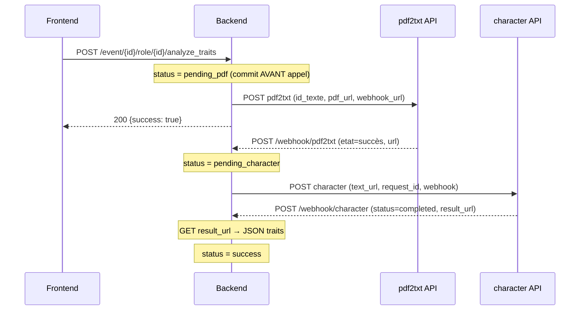

# Audit Webhooks v2 — Post-corrections

Audit complet du flux de webhooks (GForms + analyse de traits de caractère) après les corrections appliquées dans la conversation précédente.

## Flux nominal rappel



---

## Bilan des corrections précédentes

Toutes les corrections identifiées lors du premier audit sont **confirmées en place** :

| # | Problème | Statut |
|---|----------|--------|
| 1 | Routes sans `@login_required` / `@organizer_required` | ✅ Corrigé ([L590-591](file:///home/jack/dev/gnmanager/routes/webhook_routes.py#L590-L591)) |
| 2 | Race condition : commit après l'appel API | ✅ Corrigé ([L611-613](file:///home/jack/dev/gnmanager/routes/webhook_routes.py#L611-L613)) |
| 3 | `id_texte` avec format unique `Nom_roleId_eventId_appRoot` | ✅ Corrigé ([character_service.py L76-78](file:///home/jack/dev/gnmanager/services/character_service.py#L76-L78)) |
| 4 | Scheme toujours `https` (bug copier-coller) | ✅ Corrigé ([character_service.py L47](file:///home/jack/dev/gnmanager/services/character_service.py#L47)) |
| 5 | État `cancelled` non distingué visuellement | ✅ Corrigé ([event_organizer_tabs.html L492-495](file:///home/jack/dev/gnmanager/templates/partials/event_organizer_tabs.html#L492-L495)) |
| 6 | Imports inutilisés dans `analyze_traits` | ✅ Corrigé (supprimés) |
| 7 | Tokens/headers masqués dans les logs | ✅ Corrigé ([webhook_routes.py L404-405](file:///home/jack/dev/gnmanager/routes/webhook_routes.py#L404-L405)) |

---

## Nouveaux problèmes identifiés

### ~~🔴 FAUX POSITIF — Fonctions JS `launchTraitsAnalysis` / `cancelTraitsAnalysis`~~

> [!NOTE]
> **Fonctions trouvées** dans [event_organizer_tabs.js L43-142](file:///home/jack/dev/gnmanager/static/js/event_organizer_tabs.js#L43-L142). Les boutons fonctionnent correctement.

---

### ~~🟡 FAUX POSITIF — Affichage brut du JSON dans le popover des traits~~

> [!NOTE]
> **Déjà géré** par `formatTraitsContent()` dans [event_organizer_tabs.js L768-785](file:///home/jack/dev/gnmanager/static/js/event_organizer_tabs.js#L768-L785). Le JS parse le JSON et crée du HTML formaté pour le popover.

---

### 🟡 MAJEUR — Réponse `result_url` : headers loggés en clair

Dans [webhook_routes.py L541](file:///home/jack/dev/gnmanager/routes/webhook_routes.py#L541) :

```python
logger.info(f"   Headers:      {dict(resp.headers)}")
```

Les headers de la **réponse** du service `result_url` (GET externe) sont loggés en clair. Si le serveur retourne des tokens d'authentification ou des cookies, ils seront exposés dans les logs.

**Correction :** Filtrer les headers sensibles comme pour les webhooks entrants, ou supprimer ce log (les headers d'une réponse GET sont rarement utiles au debug).

---

### 🟠 MINEUR — Configuration `PDF2TXT_API_URL` / `CHARACTER_API_URL` absente du `.env`

Le fichier [.env](file:///home/jack/dev/gnmanager/.env) ne contient **aucune** des clés de configuration nécessaires au service character :
- `PDF2TXT_API_URL`
- `PDF2TXT_TOKEN`
- `CHARACTER_API_URL`
- `CHARACTER_TOKEN`

Le code dans `character_service.py` les lit via `current_app.config.get(...)`, donc elles retournent `None` → les deux fonctions échouent systématiquement avec `"Configuration pdf2txt/character manquante"`.

> [!NOTE]
> Ces variables sont peut-être définies dans un fichier de config spécifique à l'environnement de déploiement non versionné. Mais leur absence locale empêche tout test du flux.

---

### 🟠 MINEUR — Tests `global_comment` obsolètes

Les tests [test_webhook_routes.py L333-334](file:///home/jack/dev/gnmanager/tests/test_webhook_routes.py#L333-L334) et [L372-374](file:///home/jack/dev/gnmanager/tests/test_webhook_routes.py#L372-L374) vérifient que `global_comment` est rempli par le webhook GForm.

Or, le code actuel de `webhook_routes.py` **ne touche plus** à `global_comment` (il n'y a aucune référence à `global_comment` dans le fichier). Ces tests échouent donc systématiquement.

**Correction :** Mettre à jour ou supprimer ces assertions pour refléter le comportement actuel.

---

### 🟠 MINEUR — `.env` : SECRET_KEY dupliqué + ligne cassée

Le fichier [.env](file:///home/jack/dev/gnmanager/.env) a trois définitions de `SECRET_KEY` (L11, L15, L18) et une ligne orpheline (L16) qui ressemble à la suite d'un hash tronqué.

**Correction :** Ne conserver qu'un seul `SECRET_KEY` et supprimer la ligne 16.

---

## Résumé

| # | Sévérité | Problème | Fichier | Statut |
|---|----------|----------|--------|--------|
| 1 | ~~🔴 Critique~~ | ~~Fonctions JS introuvables~~ | `event_organizer_tabs.js` | ❌ Faux positif |
| 2 | ~~🟡 Majeur~~ | ~~JSON brut dans popover~~ | `event_organizer_tabs.js` | ❌ Faux positif |
| 3 | 🟡 Majeur | Headers de réponse `result_url` loggés en clair | `webhook_routes.py` | ✅ Corrigé |
| 4 | 🟠 Mineur | Config `PDF2TXT_*` / `CHARACTER_*` absente du `.env` | `.env` | ℹ️ À configurer |
| 5 | 🟠 Mineur | Tests `global_comment` obsolètes | `test_webhook_routes.py` | ✅ Corrigé |
| 6 | 🟠 Mineur | `.env` : `SECRET_KEY` dupliqué + ligne orpheline | `.env` | ✅ Corrigé |

---

## Points positifs confirmés

- ✅ **Sécurité** : `@login_required` + `@organizer_required` sur `analyze_traits` et `cancel_traits`
- ✅ **Race condition** : commit du statut `pending_pdf` **avant** l'appel API, avec rollback en cas d'échec
- ✅ **id_texte unique** : Format `Nom_roleId_eventId_appRoot` garanti unique, avec rétrocompatibilité
- ✅ **Parsing `_find_role_by_id_texte`** : `rsplit('_', 3)` fonctionne correctement car `_sanitize_id_texte` supprime les underscores du nom
- ✅ **CSRF exempt** sur les webhooks entrants (nécessaire car appelés par des services externes)
- ✅ **Gestion de l'annulation** : statut `cancelled` bien géré dans le backend et le template
- ✅ **Tokens masqués** dans les logs des webhooks entrants
- ✅ **Scheme HTTPS** : corrigé, toujours `https` (prod derrière nginx)
